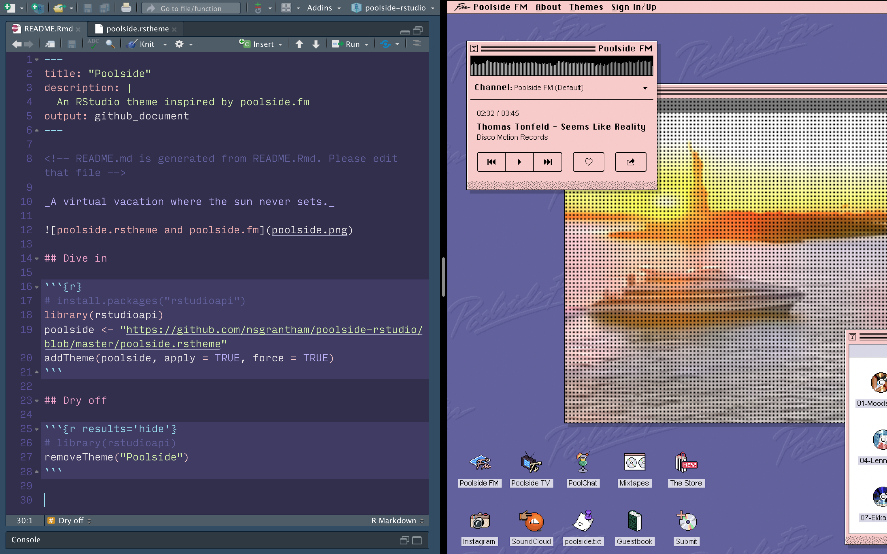

<!-- README.md is generated from README.Rmd. Please edit that file -->

_A virtual vacation where the sun never sets._



## Dive in

```{r}
# install.packages("rstudioapi")
library(rstudioapi)
poolside <- ""https://raw.githubusercontent.com/nsgrantham/poolside-rstudio/main/poolside.rstheme""
addTheme(poolside, apply = TRUE, force = TRUE)
```

## Dry off

```{r results='hide'}
# library(rstudioapi)
removeTheme("Poolside")
```

